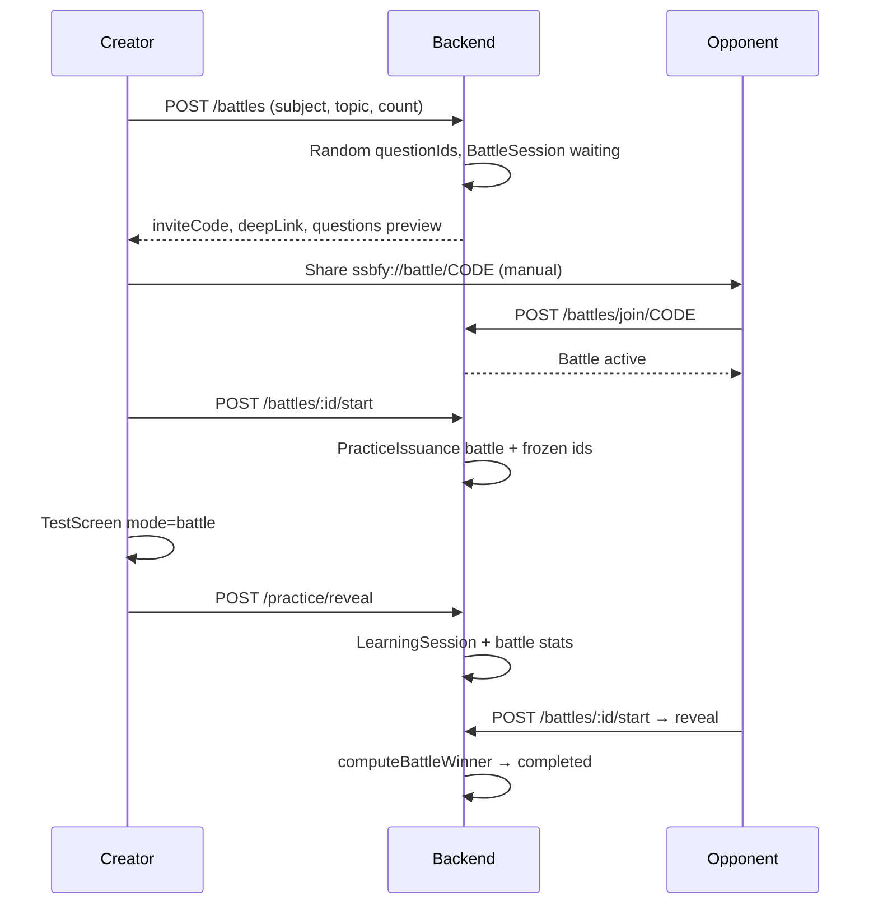

# Battle Mode V1 — Implementation Report

## Overview

Battle Mode adds **async friend-vs-friend quizzes** on top of the existing immutable practice stack. There is no separate exam engine, scoring engine, or realtime layer.

| Layer | Reuse |
|--------|--------|
| Question freeze | `BattleSession.questionIds` at create (server `$sample`) |
| Attempt provenance | `PracticeIssuance` (`practiceType: battle`, `battleSessionId`) |
| Scoring + snapshot | `POST /practice/reveal` → `scoreQuestionSession` → `LearningSession` |
| Result hydration | `GET /learning-sessions/:id` (unchanged) |
| Winner | `battleService.onRevealComplete` after reveal |

---

## Architecture

---

## Schema decisions

### `BattleSession`

- **Immutable after create:** `questionIds`, `subjectId`, `topicId`, `difficulty`, `questionCount`, `timerMode`
- **Lifecycle:** `waiting` → `active` → `completed` | `expired`
- **Attempts:** `creatorAttemptId` / `opponentAttemptId` → `LearningSession` ObjectIds
- **Single play per side:** `creatorIssuanceId` / `opponentIssuanceId` set on first `start`
- **Winner fields:** scores, incorrect counts, `timeTakenMs` (server: `completedAt - startedAt`)
- **Expiry:** `expiresAt` = create + **48h**; lazy `expired` on read

### `BattleUsage`

- Key: `(userId, dateKey)` UTC `YYYY-MM-DD`
- Counters: `createdCount`, `joinedCount`

### `PracticeIssuance` (extended)

- `practiceType: 'battle'`
- `battleSessionId` — links reveal to battle completion hook

### `LearningSession` (extended)

- `sessionType: 'battle'` in constants (same snapshot pipeline)

---

## API (`/api/battles`)

| Method | Path | Purpose |
|--------|------|---------|
| GET | `/quota` | Premium + daily create/join limits |
| GET | `/availability` | Active question pool count |
| POST | `/` | Create battle (server picks questions) |
| GET | `/mine` | Recent battles for user |
| GET | `/invite/:inviteCode` | Preview before join |
| POST | `/join/:inviteCode` | Claim opponent slot |
| GET | `/:id` | Lobby state (participant only) |
| POST | `/:id/start` | Issue battle `PracticeIssuance` + questions |
| GET | `/:id/result` | Comparison payload |
| POST | `/practice/reveal` | Unchanged; battle hook on finalize |

---

## Invite flow

- **Code:** 6-char uppercase (no ambiguous `0/O/1/I`)
- **Links:** `ssbfy://battle/{code}` and `https://api.jkssbfy.in/battle/{code}` (Android App Links + `/.well-known/assetlinks.json` on `api.jkssbfy.in`)
- **Mobile:** `app.json` scheme + Android intent filter; `NavigationContainer` linking → `BattleJoin`
- **V1:** Manual share only (no push)

---

## Quota strategy (backend-authoritative)

| Tier | Create / day | Join / day |
|------|----------------|------------|
| Free | 1 | 3 |
| Premium | Unlimited | Unlimited |

- Enforced in `battleService.assertCanCreate` / `assertCanJoin`
- Counters incremented on successful create / join
- **Join remains free-tier friendly** — opponents need not be premium

---

## Immutable battle issuance

1. **Create:** `questionRepository.findRandomSmartPractice(match, questionCount)` — client never sends IDs
2. **Validate pool:** `countActiveByMatch` ≥ `questionCount` (min **5**)
3. **Start:** `PracticeIssuance` with exact `BattleSession.questionIds` order
4. **Reveal:** `orderedIdsEqual(issuance, body)` — same hardened check as practice
5. **No retry:** battle not exposed via `POST /practice/issue`; second start returns existing issuance; second reveal blocked after finalize

---

## Winner calculation

Deterministic (`computeBattleWinner`):

1. Higher `score`
2. Lower `timeTakenMs` (server elapsed from `startedAt` to reveal)
3. Fewer `incorrect`
4. Tie → `winnerUserId: null`

Runs when **both** sides have `LearningSession` attempts recorded.

---

## Edge cases

| Case | Behavior |
|------|----------|
| Expired battle | `410 GONE` `BATTLE_EXPIRED`; status → `expired` on read |
| Creator opens join link | `BATTLE_SELF_JOIN` |
| Opponent slot taken | `BATTLE_OPPONENT_TAKEN` |
| Insufficient questions | `BATTLE_INSUFFICIENT_QUESTIONS` + `availableCount` |
| Creator plays before opponent joins | Allowed (async) |
| Opponent joins but creator hasn't | Opponent can play; creator already may have score |
| Duplicate reveal | Idempotent via `clientSessionKey` + issuance finalize |
| One player finishes | Battle stays `active` until both complete or expiry |
| Abandoned battle | Expires at 48h; no cron required for V1 |

---

## Security protections

- **Ownership:** `getById`, `start`, `result` require creator or opponent
- **Question farming:** No client `questionIds` on create; issuance locked to battle set
- **Reveal integrity:** Full practice reveal pipeline (mismatch logging, scratch budget, expiry)
- **Invite abuse:** Short code + rate limits via existing `apiLimiter` on `/battles`
- **Replay:** `creatorAttemptId` / `opponentAttemptId` prevent re-scoring side
- **Join farming:** Separate join quota from create

---

## Mobile UX (V1)

| Screen | Route |
|--------|--------|
| Create | `BattleCreate` |
| Join | `BattleJoin` (+ deep link) |
| Lobby / share | `BattleLobby` |
| Play | `Test` `mode=battle` |
| Comparison | `BattleResult` |

Entry: Home → **Challenge a friend** / **Join a battle**

---

## Remaining risks

1. **Universal links** — iOS associated domains not configured in this PR; custom scheme works on Android; HTTPS may need hosted `assetlinks.json` / AASA.
2. **Display names** — Opponent shown as `name` or email; no dedicated battle profile cards.
3. **Expiry cleanup** — Lazy expiry on read; no batch job for analytics on abandoned battles.
4. **Creator plays alone** — Battle can complete with only creator if opponent never joins (winner stays null until both finish; if only one plays, never `completed`).
5. **Per-question timer** — `timerMode: per_question` reserved in schema; mobile V1 only exposes `none` and `total`.
6. **Analytics** — `UserLearningAnalytics` receives battle sessions as type `battle`; leaderboard/Elo explicitly out of scope.

---

## Rollout safety

- **Additive only:** New models, routes, screens; no changes to mock `TestAttempt` submit path
- **Practice reveal:** New type `battle` in allow-lists; hook is post-persist, non-blocking on failure
- **ResultScreen / hydration:** Unchanged; battle exits to `BattleResult` instead of `Result`
- **Rollback:** Disable `battleRoutes` mount; existing practice/mock unaffected
- **Indexes:** `inviteCode` unique; `(userId, dateKey)` on usage

---

## Files touched (summary)

**Backend:** `models/BattleSession.js`, `BattleUsage.js`, `constants/battle.js`, `services/battleService.js`, `routes/battleRoutes.js`, extensions to `PracticeIssuance`, `practiceIssuanceService`, `practiceRevealService`, `learningSessionTypes`, `questionRepository.countActiveByMatch`

**Mobile:** `services/battleService.js`, screens `BattleCreate`, `BattleJoin`, `BattleLobby`, `BattleResult`, `TestScreen` battle branch, `App.js` linking, `app.json` scheme, `HomeScreen` entry
