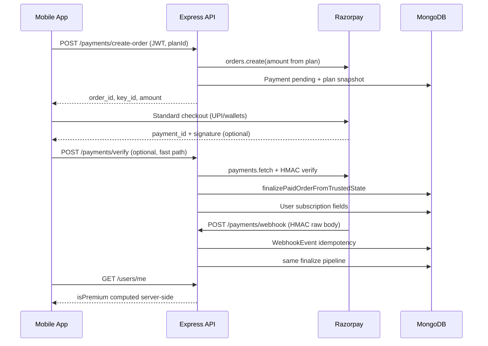

# Razorpay Premium — Architecture & Implementation Report (V1)

Production-safe Razorpay checkout for SSBFY premium subscriptions. **Razorpay only** — no Stripe/PayPal, no billing microservices, no Redis/Kafka orchestration.

## 1. Audit summary (current state)

### What exists

| Layer | Ownership |
|-------|-----------|
| Order + verify + webhook | `backend/src/services/paymentService.js` |
| HTTP | `backend/src/routes/paymentRoutes.js`, `paymentController.js` |
| Payment rows | `backend/src/models/Payment.js`, `paymentRepository.js` |
| Webhook idempotency | `backend/src/models/WebhookEvent.js`, `webhookEventRepository.js` |
| Premium truth | `backend/src/utils/freeTierAccess.js` → `isPremiumUser()` |
| User writes | `userRepository.setSubscriptionAfterPayment()` |
| Plans | `SubscriptionPlan` + `GET /subscription-plans` |
| Mobile checkout | `mobile/src/services/paymentService.js`, `PremiumScreen.js` |
| Admin reconcile | `POST /admin/payments/reconcile` |

### Current flow



### Risks addressed in this pass

| Risk | Mitigation |
|------|------------|
| Client grants premium | **Never** — only `setSubscriptionAfterPayment` on backend after verify/webhook |
| Forged signature | HMAC `order_id\|payment_id` with API secret + `payments.fetch` |
| Amount tampering | `assertAmountMatchesOrder` — gateway paise must match `Payment.amount` |
| Wrong user on order | Order row `userId` checked on verify; webhook resolves from row/notes |
| Double activation | Unique `razorpay_order_id` / partial unique `razorpay_payment_id`; idempotent finalize |
| Webhook retries | `WebhookEvent.eventId` unique + TTL 60d |
| Stale mobile premium | `GET /users/me` + `refreshUser`; optional `GET /payments/orders/:id/status` |
| UPI false failure | Checkout error still polls backend; webhook reconciles |
| App killed mid-pay | `pendingPaymentOrder` AsyncStorage + status endpoint on Premium mount |

### Remaining risks (v1 scope)

| Risk | Notes |
|------|-------|
| Refund → auto-revoke | `payment.refunded` marks row `refunded`; **premium not auto-revoked** — manual/admin |
| Webhook secret unset | Webhook returns 200 but skips processing — monitor logs |
| No Razorpay keys in prod | `create-order` 503; mobile shows friendly copy |
| Lifetime + timed overlap | `setSubscriptionAfterPayment` refuses to demote lifetime users |
| Multi-device | Premium is per-user in Mongo; `/me` is source of truth on each device |

## 2. Payment state model

`Payment.paymentStatus` (lifecycle):

| Value | Meaning |
|-------|---------|
| `pending` | Order created locally, not paid |
| `paid` | Captured/authorized and entitlement applied |
| `failed` | `payment.failed` webhook |
| `expired` | `order.expired` / `order.cancelled` |
| `refunded` | `payment.refunded` webhook (audit only in v1) |

`Payment.status` holds raw Razorpay payment status when known (`created`, `captured`, `authorized`, `failed`, `expired`, `refunded`).

## 3. Premium entitlement model

**Backend-authoritative:** `isPremiumUser(user)` in `freeTierAccess.js`.

| Plan | Storage | Access |
|------|---------|--------|
| Lifetime | `isPremium: true`, `subscriptionEnd: null` | Always premium |
| Timed (monthly/quarterly/yearly) | `isPremium: false`, `subscriptionEnd` future | Premium while `subscriptionEnd > now` |
| Expired timed | Stale `isPremium: true` ignored | **Not** premium |

`GET /users/me` overwrites `isPremium` with computed truth (`userService.getProfile`).

**Stacking:** New timed purchase extends from `max(now, subscriptionEnd)` via `subscriptionEndFromPlan`.

**Duplicate purchases:** Same `razorpay_payment_id` → idempotent heal, no double stack from finalize.

## 4. Supported payment methods (mobile)

Razorpay **standard checkout** with:

```javascript
method: { upi: true, wallet: true, card: false, netbanking: false, paylater: false, emi: false }
```

Routes **Google Pay, PhonePe, Paytm** through Razorpay UPI intent + wallet rails — no separate SDKs.

Requires **dev/production native build** (`react-native-razorpay`), not Expo Go alone.

## 5. API surface

| Method | Path | Auth | Purpose |
|--------|------|------|---------|
| POST | `/api/payments/create-order` | JWT | Create Razorpay order + pending Payment |
| POST | `/api/payments/verify` | JWT | Signature verify + activate |
| GET | `/api/payments/orders/:orderId/status` | JWT | Recovery / pending order poll |
| POST | `/api/payments/webhook` | HMAC | Razorpay events (public, rate-limited) |
| GET | `/api/subscription-plans` | Public | Active plans |
| GET | `/api/users/me` | JWT | Premium truth for UI |
| POST | `/api/admin/payments/reconcile` | Admin | Support replay |

## 6. Webhook strategy

- Raw body HMAC: `X-Razorpay-Signature` vs `RAZORPAY_WEBHOOK_SECRET` (`app.js` `verify` captures `req.rawBody`).
- Events handled: `payment.captured`, `payment.authorized`, `order.paid`, `payment.failed`, `order.expired`, `order.cancelled`, `payment.refunded`.
- Idempotency: `event.id` → `WebhookEvent` unique insert.
- Non-retryable `AppError` (<500): still **200** to stop Razorpay retry storms.
- Same `finalizePaidOrderFromTrustedState` as client verify.

**Dashboard:** Subscribe to the events above; set signing secret in env.

## 7. Idempotency protections

1. **Webhook:** `WebhookEvent.eventId` duplicate → short-circuit.
2. **Payment row:** unique `razorpay_order_id`; partial unique `razorpay_payment_id`.
3. **Finalize:** If payment id exists for same user → heal subscription only, merge `verificationSource`.
4. **Order already linked to different payment id** → 409 conflict.
5. **Plan snapshot:** Stored on Payment at order creation — never trust client amount/plan.

## 8. Mobile synchronization

1. After checkout: optional `POST /verify`, then **`refreshUser()`** (`GET /users/me`) — up to 2 polls (3s apart).
2. On Premium mount: read `pendingPaymentOrder` → `GET .../status` → refresh if paid.
3. `userHasPremiumAccess` mirrors backend `isPremiumUser`.
4. Profile/Home call `refreshUser` on focus where needed.

**Never** set premium locally from Razorpay success alone.

## 9. Battle-mode integration

`battleService` uses `isPremiumUser(user)` server-side for create/join quotas. Premium upgrade/expiry reflected on next API call — no frontend-only battle premium.

## 10. Observability

Structured logs (no secrets):

- `[PAYMENT] Order created`
- `[PAYMENT] Signature verification failed` / `Amount mismatch`
- `[PAYMENT] Activation successful (finalize)`
- `Webhook processed` with `eventId`, `eventType`, `orderId`, `paymentId`

## 11. Environment

```env
RAZORPAY_KEY_ID=
RAZORPAY_KEY_SECRET=
RAZORPAY_WEBHOOK_SECRET=
```

Never commit live secrets. Mobile receives **key_id** only (publishable). API secret and webhook secret stay server-only.

## 12. QA checklist

- [ ] UPI success → premium on Profile via `/me`
- [ ] GPay / PhonePe / Paytm via Razorpay wallet/UPI rails
- [ ] Cancel checkout → no premium; clear copy
- [ ] Duplicate verify + webhook → single entitlement, `verificationSource: both`
- [ ] Background app during UPI → return → recovery or poll succeeds
- [ ] Kill app after pay → reopen Premium → pending order recovery
- [ ] Webhook-only success (skip client verify) → premium within poll window
- [ ] Expired timed plan → mocks/battle limits apply
- [ ] Second device login after upgrade → `/me` shows premium
- [ ] Wrong-user verify on foreign order_id → 403
- [ ] Amount mismatch at gateway → 409, no grant

## 13. Rollout safety

| Step | Action |
|------|--------|
| 1 | Set Razorpay test keys + webhook secret on staging |
| 2 | Create active `monthly` plan in admin |
| 3 | EAS/dev build with `react-native-razorpay` |
| 4 | Test UPI + webhook in Razorpay dashboard logs |
| 5 | Production keys; enable webhook URL `https://<api>/api/payments/webhook` |
| 6 | Monitor `[PAYMENT]` + `Webhook processed` logs first 48h |

**Preserved:** auth, Result/reveal, battle sessions, practice issuance, PM2, Mongo — payments isolated to `paymentService` + `PremiumScreen`.

## 14. Files touched (hardening pass)

- `backend/src/services/paymentService.js` — amount assert, refund webhook, order status
- `backend/src/controllers/paymentController.js` — `getOrderStatus`
- `backend/src/routes/paymentRoutes.js` — `GET /orders/:orderId/status`
- `backend/src/validators/paymentValidators.js` — param validation
- `mobile/src/services/paymentService.js` — UPI-first methods, status API
- `mobile/src/screens/PremiumScreen.js` — recovery + pending order
- `mobile/src/utils/pendingPaymentOrder.js` — AsyncStorage helper
